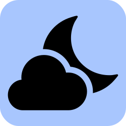

<p align="center">
  <a href="https://nimbus.town" target="_blank" rel="noopener noreferrer">
    
  </a>
</p>

<h1 align="center"/>Nimbus <sup><em>WIP</em></sup></h1>

<p align="center">
A nimble Bluesky web client
</p>

<br/>

<p align="center">
  <a href="https://nimbus.town/" target="_blank" rel="noopener noreferrer" >
    
  </a>
</p>

## ⚠️ Nimbus is Work In Progress

**Nimbus doesn't work at this point. It's just an idea and playground.**

We welcome PRs if you'd like to help and would like to play too.

## 🧑‍💻 Contributing

We're really excited that you're interested in contributing to Nimbus! Before submitting your contribution, please read through the following guide.

### Local Setup

Clone the repository and run on the root folder:

```
pnpm i
pnpm run dev
```

`Warning`: you will need `corepack` enabled, check out the [Nimbus Contributing Guide](./CONTRIBUTING.md) for a detailed guide on how to set up the project locally.

We recommend installing [ni](https://github.com/antfu/ni#ni), that will use the right package manager in each of your projects. If `ni` is installed, you can instead run:

```
ni
nr dev
```

### Testing

Nimbus uses [Vitest](https://vitest.dev). You can run the test suite with:

```
nr test
```

## 📲 PWA

You can consult the [PWA documentation](https://docs.nimbus.town/pwa) to learn more about the PWA capabilities on Nimbus, how to install Nimbus PWA in your desktop or mobile device and some hints about PWA stuff on Nimbus.

## 🦄 Stack

- [Vite](https://vitejs.dev/) - Next Generation Frontend Tooling
- [Nuxt](https://nuxt.com/) - The Intuitive Web Framework
- [Vue](https://vuejs.org/) - The Progressive JavaScript Framework
- [VueUse](https://vueuse.org/) - Collection of Vue Composition Utilities
- [Pinia](https://pinia.vuejs.org/) - The Vue Store that you will enjoy using
- [Vue Macros](https://vue-macros.sxzz.moe/) - More macros and syntax sugar for Vue
- [UnoCSS](https://uno.antfu.me/) - The instant on-demand atomic CSS engine
- [Iconify](https://github.com/iconify/icon-sets#iconify-icon-sets-in-json-format) - Iconify icon sets in JSON format
- [shiki](https://shiki.style/) - A beautiful yet powerful syntax highlighter
- [vite-plugin-pwa](https://github.com/vite-pwa/vite-plugin-pwa) - Prompt for update and Web Share Target API

- Elk was built using [Masto.js](https://neet.github.io/masto.js), Mastodon API client in TypeScript.

## Elk

Nimbus is a fork of [Elk](https://github.com/elk-zone/elk). We're leaving their sponsors and contributors section in the readme as a token of gratitude.

## 💖 Sponsors

We are grateful for the generous sponsorship and help of:

<a href="https://nuxtlabs.com/" target="_blank" rel="noopener noreferrer" >
  
</a>
<br><br>
<a href="https://stackblitz.com/" target="_blank" rel="noopener noreferrer" >
  
</a>
<br><br>

And all the companies and individuals sponsoring the Elk Team and the members. If you're enjoying the app, consider sponsoring them:

- [Elk Team's GitHub Sponsors](https://github.com/sponsors/elk-zone)

We would also appreciate you sponsoring other contributors to Bluesky and the Elk project. If someone helps you solve an issue or implement a feature you wanted, supporting them would help make this project and OS more sustainable.

## 👨‍💻 Contributors

<a href="https://github.com/nimbus-town/nimbus/graphs/contributors">
  
</a>

## 📄 License

[MIT](./LICENSE) &copy; 2022-PRESENT Elk contributors, 2024-PRESENT Nimbus contributors
